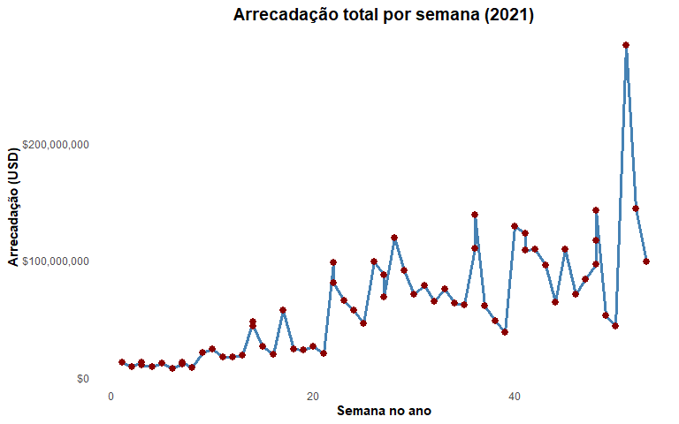
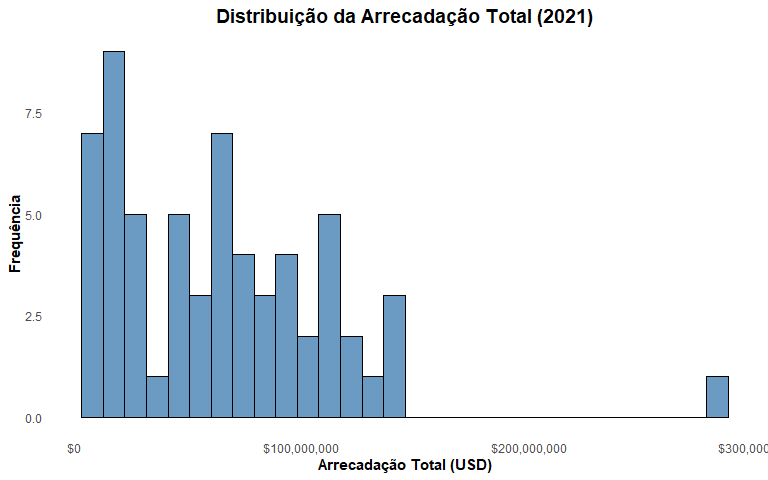
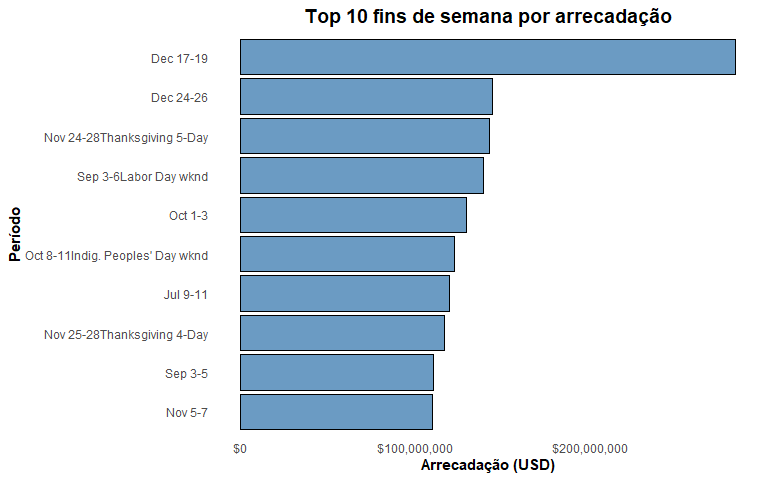
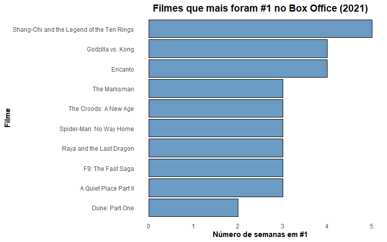

Atividade 1 - Tópicos Especiais em Estatística
================
Ramon Lima de Oliveira Tavares
14 de setembro de 2025

- [0.1 Objetivos](#01-objetivos)
- [0.2 Introdução](#02-introdução)
- [0.3 Metodologia](#03-metodologia)
- [0.4 Resultados](#04-resultados)
- [0.5 Conclusão](#05-conclusão)
- [0.6 Referências](#06-referências)
- [1 Pacotes e Configurações
  Iniciais](#1-pacotes-e-configurações-iniciais)
  - [1.1 Carregamento das bibliotecas necessárias para scraping,
    limpeza, análise e visualização de
    dados](#11-carregamento-das-bibliotecas-necessárias-para-scraping-limpeza-análise-e-visualização-de-dados)
- [2 Definição da URL e leitura da
  página](#2-definição-da-url-e-leitura-da-página)
- [3 Extração e inspeção das tabelas da
  página](#3-extração-e-inspeção-das-tabelas-da-página)
- [4 Padronização inicial dos nomes das
  colunas](#4-padronização-inicial-dos-nomes-das-colunas)
- [5 Padronização de nomes de colunas para
  PT-BR](#5-padronização-de-nomes-de-colunas-para-pt-br)
- [6 Funções utilitárias para parsing de
  dados](#6-funções-utilitárias-para-parsing-de-dados)
- [7 Aplicar parsing nas colunas (transformações numéricas passo a
  passo)](#7-aplicar-parsing-nas-colunas-transformações-numéricas-passo-a-passo)
  - [7.1 Converter arrecadação top10 para
    numérico](#71-converter-arrecadação-top10-para-numérico)
  - [7.2 Converter arrecadação total para
    numérico](#72-converter-arrecadação-total-para-numérico)
  - [7.3 Converter orçamento para numérico
    (NA)](#73-converter-orçamento-para-numérico-na)
  - [7.4 Converter percentuais para
    numérico](#74-converter-percentuais-para-numérico)
- [8 Conversão de tempos e variáveis discretas
  (NA)](#8-conversão-de-tempos-e-variáveis-discretas-na)
- [9 Validação e salvamento do dataset
  limpo](#9-validação-e-salvamento-do-dataset-limpo)
- [10 Conversão e padronização de colunas
  numéricas](#10-conversão-e-padronização-de-colunas-numéricas)
- [11 Estatísticas descritivas e amostra
  inicial](#11-estatísticas-descritivas-e-amostra-inicial)
- [12 Top 10 fins de semana com maior
  arrecadação](#12-top-10-fins-de-semana-com-maior-arrecadação)
- [13 Top 10 filmes que mais ficaram em
  \#1](#13-top-10-filmes-que-mais-ficaram-em-1)
- [14 Visualização dos Dados](#14-visualização-dos-dados)
  - [14.1 Arrecadação total por
    semana](#141-arrecadação-total-por-semana)
  - [14.2 Distribuição da arrecadação
    total](#142-distribuição-da-arrecadação-total)
  - [14.3 Top 10 fins de semana por
    arrecadação](#143-top-10-fins-de-semana-por-arrecadação)
  - [14.4 Filmes que mais ficaram em
    \#1](#144-filmes-que-mais-ficaram-em-1)
- [15 Exportar tabelas e resultados
  específicos](#15-exportar-tabelas-e-resultados-específicos)
- [16 Sessão final — Detalhes do Ambiente de
  Trabalho](#16-sessão-final--detalhes-do-ambiente-de-trabalho)

## 0.1 Objetivos

O objetivo deste trabalho é:

1.  Extrair dados do site Box Office Mojo referentes ao ano de 2021
    utilizando técnicas de web scraping em R.  
2.  Limpar e padronizar os dados obtidos para análise.  
3.  Realizar análise exploratória, incluindo estatísticas descritivas,
    tabelas e gráficos.

Link do site utilizado: [Box Office Mojo
2021](https://www.boxofficemojo.com/year/2021/)

## 0.2 Introdução

Neste trabalho, utilizamos técnicas de web scraping em R para coletar
dados do Box Office Mojo referentes ao ano de 2021, realizando a
limpeza, padronização e análise exploratória dos dados.

## 0.3 Metodologia

1.  Extração de dados do site Box Office Mojo usando `rvest` e `xml2`.
2.  Padronização dos nomes de colunas com `janitor::clean_names`.
3.  Conversão de colunas monetárias e percentuais em valores numéricos
    utilizando funções auxiliares.
4.  Realização de estatísticas descritivas e visualizações gráficas com
    `ggplot2`.

## 0.4 Resultados

- O Top 10 fins de semana com maior arrecadação inclui filmes como
  *Spider-Man: No Way Home* e *Encanto*, frequentemente associados com
  os meses de feriados prolongados.
- A análise da arrecadação total por semana mostra picos em datas
  específicas, indicando a influência de lançamentos de grande sucesso.
- Os filmes que mais permaneceram em \#1 geralmente concentraram maior
  arrecadação total.

## 0.5 Conclusão

O web scraping e a análise exploratória permitiram identificar os
períodos de maior arrecadação e os filmes de maior sucesso em 2021.
Técnicas de limpeza e padronização de dados foram fundamentais para
garantir a consistência das análises.

## 0.6 Referências

- Box Office Mojo. Yearly Box Office. Disponível em:
  <https://www.boxofficemojo.com/year/2021/>
- Wickham, H. (2016). *rvest: Easily Harvest (Scrape) Web Pages*. R
  package version 0.3.6.

# 1 Pacotes e Configurações Iniciais

## 1.1 Carregamento das bibliotecas necessárias para scraping, limpeza, análise e visualização de dados

``` r
# Carregar bibliotecas
library(rvest)     # scraping
library(xml2)      # parsing HTML/XML
library(janitor)   # limpeza de nomes
library(stringr)   # manipulação de texto
library(dplyr)     # manipulação de dados
library(ggplot2)   # gráficos
library(scales)    # formatação de eixos
library(readr)     # leitura e escrita de CSV
library(knitr)     # tabelas com kable
library(tinytex)     # tabelas com kable
```

# 2 Definição da URL e leitura da página

*Configuramos a URL alvo e carregamos o conteúdo HTML para scraping*

``` r
# URL alvo (mude aqui se quiser outro ano/página)
url <- "https://www.boxofficemojo.com/weekend/by-year/2021/"

# Leitura da página HTML (uso tryCatch para mensagem amigável)
page <- tryCatch({
  read_html(url)
}, error = function(e){
  stop("Erro ao carregar página: ", e$message)
})

# Mostrar uma breve confirmação
cat("Página lida com sucesso:", url, "\n")
```

    ## Página lida com sucesso: https://www.boxofficemojo.com/weekend/by-year/2021/

# 3 Extração e inspeção das tabelas da página

*Identificamos todas as tabelas, contamos quantas existem e visualizamos
a primeira*

``` r
# Extrair todas as tabelas
raw_tables <- page %>% html_nodes("table") %>% html_table(fill = TRUE)

# Quantas tabelas foram encontradas?
cat("Tabelas encontradas:", length(raw_tables), "\n")
```

    ## Tabelas encontradas: 1

``` r
# Visualizar a primeira tabela (resumo)
raw_df <- raw_tables[[1]]
cat("Dimensão da primeira tabela:", dim(raw_df), "\n")
```

    ## Dimensão da primeira tabela: 62 12

``` r
knitr::kable(head(raw_df, 6), caption = "Amostra (6 primeiras linhas) da tabela bruta")
```

| Dates | Top 10 Gross | %± LW | Overall Gross | %± LW | Releases | \#1 Release | Genre | Budget | Running Time | Week | Long Weekend |
|:---|:---|:---|:---|:---|---:|:---|:---|:---|:---|---:|:---|
| Dec 31-Jan 2, 2022 | \$95,723,075 | -31.6% | \$98,910,707 | -31.2% | 35 | Spider-Man: No Way Home | \- | \- | \- | 53 | false |
| Dec 24-26 | \$139,868,872 | -50.4% | \$143,835,740 | -49.2% | 40 | Spider-Man: No Way Home | \- | \- | \- | 52 | false |
| Dec 17-19 | \$281,737,588 | +591.1% | \$282,972,675 | +544% | 43 | Spider-Man: No Way Home | \- | \- | \- | 51 | false |
| Dec 10-12 | \$40,765,448 | -14.2% | \$43,940,100 | -16.6% | 45 | West Side Story | \- | \- | \- | 50 | false |
| Dec 3-5Post-Thanksgiving | \$47,539,355 | -48.7% | \$52,704,939 | -45.4% | 47 | Encanto | \- | \- | \- | 49 | false |
| Nov 26-28Thanksgiving 3-Day | \$92,724,526 | +15.4% | \$96,526,140 | +15.5% | 51 | Encanto | \- | \- | \- | 48 | false |

Amostra (6 primeiras linhas) da tabela bruta

# 4 Padronização inicial dos nomes das colunas

*Aplicamos janitor::clean_names() para gerar nomes consistentes e
facilitar manipulação*

``` r
df <- raw_df %>% janitor::clean_names()
cat("Nomes de colunas após clean_names():\n")
```

    ## Nomes de colunas após clean_names():

``` r
print(names(df))
```

    ##  [1] "dates"            "top_10_gross"     "percent_lw"       "overall_gross"   
    ##  [5] "percent_lw_2"     "releases"         "number_1_release" "genre"           
    ##  [9] "budget"           "running_time"     "week"             "long_weekend"

# 5 Padronização de nomes de colunas para PT-BR

*Renomeia colunas para nomes claros, sem espaços, em português,
facilitando a análise*

``` r
df <- df %>% dplyr::rename(
  periodo = dates,
  arrecadacao_top10 = top_10_gross,
  pct_var_top10 = percent_lw,
  arrecadacao_total = overall_gross,
  pct_var_total = percent_lw_2,
  lancamentos = releases,
  lancamento_n1 = number_1_release,
  genero = genre,
  orcamento = budget,
  tempo_execucao = running_time,
  semana = week,
  feriado_prolongado = long_weekend
)

cat("Nomes finais (após renomear):\n")
```

    ## Nomes finais (após renomear):

``` r
print(names(df))
```

    ##  [1] "periodo"            "arrecadacao_top10"  "pct_var_top10"     
    ##  [4] "arrecadacao_total"  "pct_var_total"      "lancamentos"       
    ##  [7] "lancamento_n1"      "genero"             "orcamento"         
    ## [10] "tempo_execucao"     "semana"             "feriado_prolongado"

``` r
knitr::kable(head(df, 5), caption = "Amostra das colunas renomeadas")
```

| periodo | arrecadacao_top10 | pct_var_top10 | arrecadacao_total | pct_var_total | lancamentos | lancamento_n1 | genero | orcamento | tempo_execucao | semana | feriado_prolongado |
|:---|:---|:---|:---|:---|---:|:---|:---|:---|:---|---:|:---|
| Dec 31-Jan 2, 2022 | \$95,723,075 | -31.6% | \$98,910,707 | -31.2% | 35 | Spider-Man: No Way Home | \- | \- | \- | 53 | false |
| Dec 24-26 | \$139,868,872 | -50.4% | \$143,835,740 | -49.2% | 40 | Spider-Man: No Way Home | \- | \- | \- | 52 | false |
| Dec 17-19 | \$281,737,588 | +591.1% | \$282,972,675 | +544% | 43 | Spider-Man: No Way Home | \- | \- | \- | 51 | false |
| Dec 10-12 | \$40,765,448 | -14.2% | \$43,940,100 | -16.6% | 45 | West Side Story | \- | \- | \- | 50 | false |
| Dec 3-5Post-Thanksgiving | \$47,539,355 | -48.7% | \$52,704,939 | -45.4% | 47 | Encanto | \- | \- | \- | 49 | false |

Amostra das colunas renomeadas

# 6 Funções utilitárias para parsing de dados

*Transformam strings de moeda, percentuais e duração em valores
numéricos*

``` r
# parse_money: remove $ , ( ) nbsp e converte para numeric
parse_money <- function(x){
  x <- as.character(x)
  x[is.na(x) | x=="" | x %in% c("-", "N/A", "None")] <- NA
  x <- str_replace_all(x, "\\$|\\,|\\u00A0|\\s|\\(|\\)", "")
  x[x == ""] <- NA
  as.numeric(x)
}

# parse_percent: remove % e sinais e converte para numeric
parse_percent <- function(x){
  x <- as.character(x)
  x[is.na(x) | x=="" | x %in% c("-", "N/A", "None")] <- NA
  x <- str_replace_all(x, "\\%", "")
  x <- str_replace_all(x, "<", "")
  x <- str_replace_all(x, ",", ".")
  x <- str_trim(x)
  as.numeric(x)
}

# parse_runtime_to_minutes: converte "2 hr 7 min" ou "127 min" para minutos
parse_runtime_to_minutes <- function(rt){
  rt <- as.character(rt)
  rt[is.na(rt) | rt=="" | rt %in% c("-", "N/A", "None")] <- NA
  mins <- rep(NA_real_, length(rt))
  for(i in seq_along(rt)){
    s <- rt[i]
    if(is.na(s)){ mins[i] <- NA; next }
    h <- as.numeric(str_extract(s, "\\d+(?=\\s*hr|\\s*hrs|\\s*h)"))
    m <- as.numeric(str_extract(s, "\\d+(?=\\s*min|\\s*m)"))
    if(!is.na(h) | !is.na(m)){
      h_val <- ifelse(is.na(h), 0, h)
      m_val <- ifelse(is.na(m), 0, m)
      mins[i] <- h_val*60 + m_val
      next
    }
    num_only <- as.numeric(str_extract(s, "\\d+"))
    if(!is.na(num_only)){
      if(str_detect(s, "(min|m)")) mins[i] <- num_only
      else if(str_detect(s, "hr|h")) mins[i] <- num_only*60
      else mins[i] <- num_only
    } else {
      mins[i] <- NA_real_
    }
  }
  mins
}

# Teste rápido das funções em exemplos
ex_money <- c("$1,234", "($12)", "N/A", "$0")
ex_percent <- c("+12%", "-3.4%", "<0.1%", "N/A")
ex_time <- c("2 hr 7 min", "127 min", "2h", "N/A")
cat("parse_money:", parse_money(ex_money), "\n")
```

    ## parse_money: 1234 12 NA 0

``` r
cat("parse_percent:", parse_percent(ex_percent), "\n")
```

    ## parse_percent: 12 -3.4 0.1 NA

``` r
cat("parse_runtime:", parse_runtime_to_minutes(ex_time), "\n")
```

    ## parse_runtime: 127 127 120 NA

# 7 Aplicar parsing nas colunas (transformações numéricas passo a passo)

*Cada coluna é convertida individualmente e verificamos resultados
intermediários*

## 7.1 Converter arrecadação top10 para numérico

*Transformação de valores monetários em numeric para análise*

``` r
if("arrecadacao_top10" %in% names(df)){
  df$arrecadacao_top10_num <- parse_money(df$arrecadacao_top10)
  cat("Exemplos arrecadacao_top10 -> numeric:\n")
  print(head(df %>% select(arrecadacao_top10, arrecadacao_top10_num), 6))
}
```

    ## Exemplos arrecadacao_top10 -> numeric:
    ## # A tibble: 6 × 2
    ##   arrecadacao_top10 arrecadacao_top10_num
    ##   <chr>                             <dbl>
    ## 1 $95,723,075                    95723075
    ## 2 $139,868,872                  139868872
    ## 3 $281,737,588                  281737588
    ## 4 $40,765,448                    40765448
    ## 5 $47,539,355                    47539355
    ## 6 $92,724,526                    92724526

## 7.2 Converter arrecadação total para numérico

*Transformação de valores monetários em numeric para análise*

``` r
if("arrecadacao_total" %in% names(df)){
  df$arrecadacao_total_num <- parse_money(df$arrecadacao_total)
  cat("Exemplos arrecadacao_total -> numeric:\n")
  print(head(df %>% select(arrecadacao_total, arrecadacao_total_num), 6))
}
```

    ## Exemplos arrecadacao_total -> numeric:
    ## # A tibble: 6 × 2
    ##   arrecadacao_total arrecadacao_total_num
    ##   <chr>                             <dbl>
    ## 1 $98,910,707                    98910707
    ## 2 $143,835,740                  143835740
    ## 3 $282,972,675                  282972675
    ## 4 $43,940,100                    43940100
    ## 5 $52,704,939                    52704939
    ## 6 $96,526,140                    96526140

## 7.3 Converter orçamento para numérico (NA)

*Aqui seria uma transformação de valores monetários em numeric para
análise, porém, não existe informações disponível dessa variável no
site*

``` r
# Orcamento
if("orcamento" %in% names(df)){
  df$orcamento_num <- parse_money(df$orcamento)
  cat("Exemplos orcamento -> numeric:\n")
  print(head(df %>% select(orcamento, orcamento_num), 6))
}
```

    ## Exemplos orcamento -> numeric:
    ## # A tibble: 6 × 2
    ##   orcamento orcamento_num
    ##   <chr>             <dbl>
    ## 1 -                    NA
    ## 2 -                    NA
    ## 3 -                    NA
    ## 4 -                    NA
    ## 5 -                    NA
    ## 6 -                    NA

## 7.4 Converter percentuais para numérico

*Transformação de percentuais em numeric para análise*

``` r
if("pct_var_top10" %in% names(df)){
  df$pct_var_top10_num <- parse_percent(df$pct_var_top10)
  cat("Exemplos pct_var_top10 -> numeric:\n")
  print(head(df %>% select(pct_var_top10, pct_var_top10_num), 6))
}
```

    ## Exemplos pct_var_top10 -> numeric:
    ## # A tibble: 6 × 2
    ##   pct_var_top10 pct_var_top10_num
    ##   <chr>                     <dbl>
    ## 1 -31.6%                    -31.6
    ## 2 -50.4%                    -50.4
    ## 3 +591.1%                   591. 
    ## 4 -14.2%                    -14.2
    ## 5 -48.7%                    -48.7
    ## 6 +15.4%                     15.4

``` r
if("pct_var_total" %in% names(df)){
  df$pct_var_total_num <- parse_percent(df$pct_var_total)
  cat("Exemplos pct_var_total -> numeric:\n")
  print(head(df %>% select(pct_var_total, pct_var_total_num), 6))
}
```

    ## Exemplos pct_var_total -> numeric:
    ## # A tibble: 6 × 2
    ##   pct_var_total pct_var_total_num
    ##   <chr>                     <dbl>
    ## 1 -31.2%                    -31.2
    ## 2 -49.2%                    -49.2
    ## 3 +544%                     544  
    ## 4 -16.6%                    -16.6
    ## 5 -45.4%                    -45.4
    ## 6 +15.5%                     15.5

# 8 Conversão de tempos e variáveis discretas (NA)

*Aqui seria a transformação de duração em minutos e padronização de
colunas inteiras, porém, não existe informações disponível dessa
variável no site*

``` r
if("tempo_execucao" %in% names(df)){
  df$tempo_execucao_min <- parse_runtime_to_minutes(df$tempo_execucao)
  cat("Exemplos tempo_execucao -> minutos:\n")
  print(head(df %>% select(tempo_execucao, tempo_execucao_min), 6))
}
```

    ## Exemplos tempo_execucao -> minutos:
    ## # A tibble: 6 × 2
    ##   tempo_execucao tempo_execucao_min
    ##   <chr>                       <dbl>
    ## 1 -                              NA
    ## 2 -                              NA
    ## 3 -                              NA
    ## 4 -                              NA
    ## 5 -                              NA
    ## 6 -                              NA

``` r
# Converter lancamentos e semana para inteiro (com proteção)
if("lancamentos" %in% names(df)) df$lancamentos <- suppressWarnings(as.integer(df$lancamentos))
if("semana" %in% names(df)) df$semana <- suppressWarnings(as.integer(df$semana))
```

# 9 Validação e salvamento do dataset limpo

*Conferência de dimensões, tipos e estatísticas básicas antes de salvar*

``` r
# Verificação rápida
cat("Dimensões do df limpo:", dim(df), "\n")
```

    ## Dimensões do df limpo: 62 18

``` r
cat("Nomes finais:\n"); print(names(df))
```

    ## Nomes finais:

    ##  [1] "periodo"               "arrecadacao_top10"     "pct_var_top10"        
    ##  [4] "arrecadacao_total"     "pct_var_total"         "lancamentos"          
    ##  [7] "lancamento_n1"         "genero"                "orcamento"            
    ## [10] "tempo_execucao"        "semana"                "feriado_prolongado"   
    ## [13] "arrecadacao_top10_num" "arrecadacao_total_num" "orcamento_num"        
    ## [16] "pct_var_top10_num"     "pct_var_total_num"     "tempo_execucao_min"

``` r
# Mostrar estatísticas básicas de algumas colunas já numéricas
num_cols <- c("arrecadacao_total_num","arrecadacao_top10_num","orcamento_num","tempo_execucao_min","lancamentos")
num_cols_exist <- num_cols[num_cols %in% names(df)]
summary(df %>% select(all_of(num_cols_exist)))
```

    ##  arrecadacao_total_num arrecadacao_top10_num orcamento_num tempo_execucao_min
    ##  Min.   :  7904141     Min.   :  7293328     Min.   : NA   Min.   : NA       
    ##  1st Qu.: 21589712     1st Qu.: 20153656     1st Qu.: NA   1st Qu.: NA       
    ##  Median : 61437163     Median : 58054122     Median : NA   Median : NA       
    ##  Mean   : 64407487     Mean   : 62156595     Mean   :NaN   Mean   :NaN       
    ##  3rd Qu.: 96377857     3rd Qu.: 94195709     3rd Qu.: NA   3rd Qu.: NA       
    ##  Max.   :282972675     Max.   :281737588     Max.   : NA   Max.   : NA       
    ##                                              NA's   :62    NA's   :62        
    ##   lancamentos   
    ##  Min.   :21.00  
    ##  1st Qu.:39.25  
    ##  Median :45.00  
    ##  Mean   :43.39  
    ##  3rd Qu.:49.00  
    ##  Max.   :59.00  
    ## 

``` r
# Salvar arquivos
readr::write_csv(df, file.path("output","boxofficemojo_2021_clean.csv"))
saveRDS(df, file.path("output","boxofficemojo_2021_clean.rds"))
cat("Arquivos salvos em output/\n")
```

    ## Arquivos salvos em output/

# 10 Conversão e padronização de colunas numéricas

*Transformação de valores monetários, percentuais e tempos em formatos
numéricos*

``` r
# chunk 5: 
df <- df %>%
  mutate(
    arrecadacao_top10_num   = if ("arrecadacao_top10"   %in% names(.)) parse_money(arrecadacao_top10) else NA_real_,
    arrecadacao_total_num   = if ("arrecadacao_total"   %in% names(.)) parse_money(arrecadacao_total) else NA_real_,
    orcamento_num           = if ("orcamento"           %in% names(.)) parse_money(orcamento) else NA_real_,
    pct_var_top10_num       = if ("pct_var_top10"       %in% names(.)) parse_percent(pct_var_top10) else NA_real_,
    pct_var_total_num       = if ("pct_var_total"       %in% names(.)) parse_percent(pct_var_total) else NA_real_,
    tempo_execucao_min      = if ("tempo_execucao"      %in% names(.)) parse_runtime_to_minutes(tempo_execucao) else NA_real_,
    lancamentos             = if ("lancamentos"         %in% names(.)) as.integer(lancamentos) else lancamentos,
    semana                  = if ("semana"              %in% names(.)) as.integer(semana) else semana
  )

cat("Colunas numéricas criadas (mostrando amostra):\n")
```

    ## Colunas numéricas criadas (mostrando amostra):

``` r
print(df %>% select(matches("arrecadacao|pct_var|orcamento|tempo_execucao|min"), lancamentos, semana) %>% head(5))
```

    ## # A tibble: 5 × 14
    ##   arrecadacao_top10 pct_var_top10 arrecadacao_total pct_var_total orcamento
    ##   <chr>             <chr>         <chr>             <chr>         <chr>    
    ## 1 $95,723,075       -31.6%        $98,910,707       -31.2%        -        
    ## 2 $139,868,872      -50.4%        $143,835,740      -49.2%        -        
    ## 3 $281,737,588      +591.1%       $282,972,675      +544%         -        
    ## 4 $40,765,448       -14.2%        $43,940,100       -16.6%        -        
    ## 5 $47,539,355       -48.7%        $52,704,939       -45.4%        -        
    ## # ℹ 9 more variables: tempo_execucao <chr>, arrecadacao_top10_num <dbl>,
    ## #   arrecadacao_total_num <dbl>, orcamento_num <dbl>, pct_var_top10_num <dbl>,
    ## #   pct_var_total_num <dbl>, tempo_execucao_min <dbl>, lancamentos <int>,
    ## #   semana <int>

# 11 Estatísticas descritivas e amostra inicial

*Sumário das variáveis numéricas e visualização das primeiras linhas*

``` r
# Sumário estatístico das colunas numéricas presentes
if(length(num_cols_exist) > 0){
  print(summary(df %>% select(all_of(num_cols_exist))))
} else {
  cat("Nenhuma coluna numérica de interesse encontrada.\n")
}
```

    ##  arrecadacao_total_num arrecadacao_top10_num orcamento_num tempo_execucao_min
    ##  Min.   :  7904141     Min.   :  7293328     Min.   : NA   Min.   : NA       
    ##  1st Qu.: 21589712     1st Qu.: 20153656     1st Qu.: NA   1st Qu.: NA       
    ##  Median : 61437163     Median : 58054122     Median : NA   Median : NA       
    ##  Mean   : 64407487     Mean   : 62156595     Mean   :NaN   Mean   :NaN       
    ##  3rd Qu.: 96377857     3rd Qu.: 94195709     3rd Qu.: NA   3rd Qu.: NA       
    ##  Max.   :282972675     Max.   :281737588     Max.   : NA   Max.   : NA       
    ##                                              NA's   :62    NA's   :62        
    ##   lancamentos   
    ##  Min.   :21.00  
    ##  1st Qu.:39.25  
    ##  Median :45.00  
    ##  Mean   :43.39  
    ##  3rd Qu.:49.00  
    ##  Max.   :59.00  
    ## 

``` r
# Tabela com amostra inicial
knitr::kable(
  head(df %>% select(periodo, arrecadacao_total, arrecadacao_total_num, lancamento_n1), 10),
  caption = "Amostra: período, arrecadação e filme #1"
)
```

| periodo | arrecadacao_total | arrecadacao_total_num | lancamento_n1 |
|:---|:---|---:|:---|
| Dec 31-Jan 2, 2022 | \$98,910,707 | 98910707 | Spider-Man: No Way Home |
| Dec 24-26 | \$143,835,740 | 143835740 | Spider-Man: No Way Home |
| Dec 17-19 | \$282,972,675 | 282972675 | Spider-Man: No Way Home |
| Dec 10-12 | \$43,940,100 | 43940100 | West Side Story |
| Dec 3-5Post-Thanksgiving | \$52,704,939 | 52704939 | Encanto |
| Nov 26-28Thanksgiving 3-Day | \$96,526,140 | 96526140 | Encanto |
| Nov 25-28Thanksgiving 4-Day | \$116,694,008 | 116694008 | Encanto |
| Nov 24-28Thanksgiving 5-Day | \$142,082,464 | 142082464 | Encanto |
| Nov 19-21 | \$83,605,882 | 83605882 | Ghostbusters: Afterlife |
| Nov 12-14 | \$70,592,982 | 70592982 | Eternals |

Amostra: período, arrecadação e filme \#1

# 12 Top 10 fins de semana com maior arrecadação

*Exibe os períodos com maior receita e fornece interpretação sobre
lançamentos e feriados*

``` r
if("arrecadacao_total_num" %in% names(df)){
  top10_weeks <- df %>%
    arrange(desc(arrecadacao_total_num)) %>%
    slice_head(n = 10) %>%
    select(periodo, arrecadacao_total, arrecadacao_total_num, lancamento_n1, lancamentos, semana)
  
  # Mostrar tabela de forma elegante
  knitr::kable(
    top10_weeks, 
    caption = "Top 10 fins de semana por arrecadação total (USD)"
  )
  
  cat("Interpretação: períodos com maior arrecadação geralmente coincidem com lançamentos de grande apelo ou feriados prolongados.\n")
}
```

    ## Interpretação: períodos com maior arrecadação geralmente coincidem com lançamentos de grande apelo ou feriados prolongados.

# 13 Top 10 filmes que mais ficaram em \#1

*Mostra os filmes com maior número de semanas no topo e interpreta a
tendência de receita*

``` r
if("lancamento_n1" %in% names(df)){
  top1_counts <- df %>%
    group_by(lancamento_n1) %>%
    summarise(
      semanas_no_top1 = n(),
      total_arrecadacao = sum(arrecadacao_total_num, na.rm = TRUE),
      .groups = "drop"
    ) %>%
    arrange(desc(semanas_no_top1)) %>%
    slice_head(n = 10)
  
  # Exibe a tabela de forma elegante
  knitr::kable(
    top1_counts, 
    caption = "Top 10 filmes que mais ficaram em #1 (n semanas e receita total)"
  )
  
  cat("Interpretação: filmes com mais semanas em #1 tendem a concentrar maior arrecadação.\n")
}
```

    ## Interpretação: filmes com mais semanas em #1 tendem a concentrar maior arrecadação.

# 14 Visualização dos Dados

## 14.1 Arrecadação total por semana

*Mostra a evolução da arrecadação total ao longo das semanas de 2021.*

``` r
if(all(c("semana","arrecadacao_total_num") %in% names(df))){
  p_time <- df %>% arrange(semana) %>%
    ggplot(aes(x = semana, y = arrecadacao_total_num)) +
    geom_line(color = "steelblue", size = 1.2) +
    geom_point(color = "darkred", size = 2.5) +
    scale_y_continuous(labels = scales::dollar_format(prefix = "$")) +
    labs(title = "Arrecadação total por semana (2021)", x = "Semana no ano", y = "Arrecadação (USD)") +
    theme_minimal() +
    theme(
      plot.title = element_text(face = "bold", hjust = 0.5, size = 14),
      axis.title = element_text(face = "bold"),
      panel.grid = element_blank()
    )
  print(p_time)
}
```

<!-- -->

## 14.2 Distribuição da arrecadação total

*Histograma que apresenta a frequência dos fins de semana em diferentes
faixas de arrecadação.*

``` r
if("arrecadacao_total_num" %in% names(df)){
  p_hist <- ggplot(df, aes(x = arrecadacao_total_num)) +
    geom_histogram(bins=30, fill="steelblue", color="black", alpha=0.8) +
    scale_x_continuous(labels=scales::dollar_format(prefix="$")) +
    labs(title="Distribuição da Arrecadação Total (2021)", x="Arrecadação Total (USD)", y="Frequência") +
    theme_minimal() +
    theme(
      plot.title=element_text(face="bold", hjust=0.5, size=14),
      axis.title=element_text(face="bold"),
      panel.grid=element_blank()
    )
  print(p_hist)
}
```

<!-- -->

## 14.3 Top 10 fins de semana por arrecadação

*Gráfico de barras horizontais mostrando os períodos de maior
arrecadação.*

``` r
if(exists("top10_weeks") && nrow(top10_weeks) > 0){
  p_bar <- top10_weeks %>% 
    ggplot(aes(x=reorder(periodo, arrecadacao_total_num), y=arrecadacao_total_num)) +
    geom_col(fill="steelblue", color="black", alpha=0.8) +
    coord_flip() +
    scale_y_continuous(labels=scales::dollar_format(prefix="$")) +
    labs(title="Top 10 fins de semana por arrecadação", x="Período", y="Arrecadação (USD)") +
    theme_minimal() +
    theme(
      plot.title=element_text(face="bold", hjust=0.5, size=14),
      axis.title=element_text(face="bold"),
      panel.grid=element_blank()
    )
  print(p_bar)
}
```

<!-- -->

## 14.4 Filmes que mais ficaram em \#1

*Top filmes que lideraram a arrecadação por número de semanas.*

``` r
if("lancamento_n1" %in% names(df)){
  freq_top1 <- df %>% group_by(lancamento_n1) %>%
    summarise(semana_no_top1 = n(), .groups="drop") %>%
    arrange(desc(semana_no_top1)) %>% slice_head(n=10)
  
  p_top1 <- ggplot(freq_top1, aes(x=reorder(lancamento_n1, semana_no_top1), y=semana_no_top1)) +
    geom_col(fill="steelblue", color="black", alpha=0.8) +
    coord_flip() +
    labs(title="Filmes que mais foram #1 no Box Office (2021)", x="Filme", y="Número de semanas em #1") +
    theme_minimal() +
    theme(
      plot.title=element_text(face="bold", hjust=0.5, size=14),
      axis.title=element_text(face="bold"),
      panel.grid=element_blank()
    )
  print(p_top1)
}
```

<!-- -->

# 15 Exportar tabelas e resultados específicos

*Exibe as tabelas principais e salva arquivos CSV para download*

``` r
if(exists("top10_weeks")) {
  # Mostrar tabela no Markdown
  knitr::kable(top10_weeks, caption = "Top 10 fins de semana por arrecadação")
  
  # Salvar CSV
  readr::write_csv(top10_weeks, file.path("output","top10_weeks.csv"))
  
  # Link de download (Markdown renderizado)
  cat("[Download CSV Top10](output/top10_weeks.csv)\n\n")
}
```

    ## [Download CSV Top10](output/top10_weeks.csv)

``` r
if(exists("top1_counts")) {
  # Mostrar tabela no Markdown
  knitr::kable(top1_counts, caption = "Top filmes que mais foram #1")
  
  # Salvar CSV
  readr::write_csv(top1_counts, file.path("output","top1_counts.csv"))
  
  # Link de download
  cat("[Download CSV Filmes #1](output/top1_counts.csv)\n")
}
```

    ## [Download CSV Filmes #1](output/top1_counts.csv)

``` r
cat("Tabelas top10 e top1 salvas em output/ (se existirem)\n")
```

    ## Tabelas top10 e top1 salvas em output/ (se existirem)

# 16 Sessão final — Detalhes do Ambiente de Trabalho

``` r
sessionInfo()
```

    ## R version 4.5.1 (2025-06-13 ucrt)
    ## Platform: x86_64-w64-mingw32/x64
    ## Running under: Windows 10 x64 (build 19045)
    ## 
    ## Matrix products: default
    ##   LAPACK version 3.12.1
    ## 
    ## locale:
    ## [1] LC_COLLATE=Portuguese_Brazil.utf8  LC_CTYPE=Portuguese_Brazil.utf8   
    ## [3] LC_MONETARY=Portuguese_Brazil.utf8 LC_NUMERIC=C                      
    ## [5] LC_TIME=Portuguese_Brazil.utf8    
    ## 
    ## time zone: America/Sao_Paulo
    ## tzcode source: internal
    ## 
    ## attached base packages:
    ## [1] stats     graphics  grDevices utils     datasets  methods   base     
    ## 
    ## other attached packages:
    ##  [1] tinytex_0.57  knitr_1.50    readr_2.1.5   scales_1.4.0  ggplot2_4.0.0
    ##  [6] stringr_1.5.2 dplyr_1.1.4   janitor_2.2.1 xml2_1.4.0    rvest_1.0.5  
    ## 
    ## loaded via a namespace (and not attached):
    ##  [1] utf8_1.2.6         generics_0.1.4     stringi_1.8.7      hms_1.1.3         
    ##  [5] digest_0.6.37      magrittr_2.0.3     evaluate_1.0.5     grid_4.5.1        
    ##  [9] timechange_0.3.0   RColorBrewer_1.1-3 fastmap_1.2.0      jsonlite_2.0.0    
    ## [13] processx_3.8.6     chromote_0.5.1     ps_1.9.1           promises_1.3.3    
    ## [17] httr_1.4.7         selectr_0.4-2      cli_3.6.5          crayon_1.5.3      
    ## [21] rlang_1.1.6        bit64_4.6.0-1      withr_3.0.2        yaml_2.3.10       
    ## [25] parallel_4.5.1     tools_4.5.1        tzdb_0.5.0         curl_7.0.0        
    ## [29] vctrs_0.6.5        R6_2.6.1           lifecycle_1.0.4    lubridate_1.9.4   
    ## [33] snakecase_0.11.1   bit_4.6.0          vroom_1.6.5        pkgconfig_2.0.3   
    ## [37] pillar_1.11.0      later_1.4.4        gtable_0.3.6       glue_1.8.0        
    ## [41] Rcpp_1.1.0         xfun_0.53          tibble_3.3.0       tidyselect_1.2.1  
    ## [45] rstudioapi_0.17.1  farver_2.1.2       htmltools_0.5.8.1  websocket_1.4.4   
    ## [49] labeling_0.4.3     rmarkdown_2.29     compiler_4.5.1     S7_0.2.0
